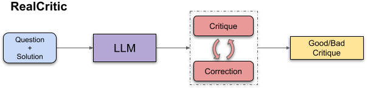

# RealCritic: Towards Effectiveness-Driven Evaluation of Language Model Critiques

<p align="center" width="100%">
<a ></a>
</p> 

RealCritic is a novel benchmark for evaluating language models' critique capabilities through a closed-loop, effectiveness-driven approach. Unlike traditional open-loop evaluations, we measure critique quality based on its ability to drive solution improvement.

## Key Contributions

1. **Closed-loop Evaluation**: Measures critique quality through improvement in refined solutions rather than isolated judgments
2. **Comprehensive Assessment**: First benchmark to evaluate self-critique, cross-critique, and iterative critique capabilities
3. **Novel Findings**: Reveals significant gaps between reasoning-based and traditional LLMs in critique abilities

## Benchmark Details

### Tasks
- ARC Challenge: Multiple choice science questions
- GSM8K: Grade school math problems
- MATH: Advanced mathematics
- College Math: Undergraduate mathematics
- Minerva Math: Scientific reasoning
- GPQA: Physics questions
- MMLU STEM: Science/tech/engineering/math topics
- Olympiad Bench: Competition-level problems

### Evaluation Modes
- **Direct CoT**: Baseline problem-solving ability
- **Self-Critique**: Model critiques its own solutions
- **Cross-Critique**: Model critiques other models' solutions
- **Iterative Critique**: Multi-round refinement process

## Usage

### Installation
Please follow the installation instructions in the [Qwen2.5-Math repository](https://github.com/QwenLM/Qwen2.5-Math.git).

### Local Evaluation

```bash
#!/bin/bash

PROMPT_TYPE="critic_and_correct"
USER_PROMPT_TYPE="critic_and_correct"
MODEL_NAME_OR_PATH="path/to/your/model"
DATA_DIR="data/mix_data"
DATASETS="arc-challenge,college_math,gpqa,gsm8k,math,minerva_math,mmlu_stem,olympiadbench"
MULTI_TURN=1

export CUDA_VISIBLE_DEVICES="0,1"

bash sh/local/run_cross_critic.sh $PROMPT_TYPE $USER_PROMPT_TYPE $MODEL_NAME_OR_PATH $DATA_DIR $DATASETS $MULTI_TURN

# bash sh/local/run_self_critic.sh $PROMPT_TYPE $USER_PROMPT_TYPE $MODEL_NAME_OR_PATH $DATA_DIR $DATASETS $MULTI_TURN

# bash sh/local/run_direct_cot.sh $PROMPT_TYPE $USER_PROMPT_TYPE $MODEL_NAME_OR_PATH $DATA_DIR $DATASETS
```

### API Evaluation

```bash
#!/bin/bash

PROMPT_TYPE="direct-cot"
USER_PROMPT_TYPE="default-cot"
MODEL_NAME_OR_PATH="gpt-4o"
DATA_DIR="data/mix_data"
DATASETS="arc-challenge,college_math,gpqa,gsm8k,math,minerva_math,mmlu_stem,olympiadbench"
MULTI_TURN=1

export DASHSCOPE_API_KEY="your_api_key"
export DASHSCOPE_BASE_URL="https://api.dashscope.com/v1"

bash sh/run_direct_cot.sh $PROMPT_TYPE $USER_PROMPT_TYPE $MODEL_NAME_OR_PATH $DATA_DIR $DATASETS

# bash sh/run_cross_critic.sh $PROMPT_TYPE $USER_PROMPT_TYPE $MODEL_NAME_OR_PATH $DATA_DIR $DATASETS $MULTI_TURN

# bash sh/run_self_critic.sh $PROMPT_TYPE $USER_PROMPT_TYPE $MODEL_NAME_OR_PATH $DATA_DIR $DATASETS $MULTI_TURN
```

### Post Check (Optional)

```
python3 -u model_eval_critic.py \
	--data_dir path/for/critic/math_eval \
	--model_name_or_path /post/check/model \
	--output_dir /output/dir/ \
	--data_name ${DATA_NAME} \
	--seed 0 \
	--temperature 0 \
	--top_p 1 \
```

### Customizing Prompts

All prompts are defined in `utils.py`:

```python
# System prompts
SYSTEM_PROMPT_TEMPLATES = {
    "direct-cot": "...",
    "critic_and_correct": "...",  # Must include "critic" keyword
}

# User prompts
USER_PROMPT_TEMPLATE = {
    "default-cot": {
        "type": "cot",
        "template": "..."
    },
    "critic_and_correct": {
        "type": "critic",
        "template": "..."
    }
}
```

Acknowledgements
The code in this repository is built upon [Qwen2.5-Math](https://github.com/QwenLM/Qwen2.5-Math.git). We thank the Qwen team for their excellent work and open-source contributions.